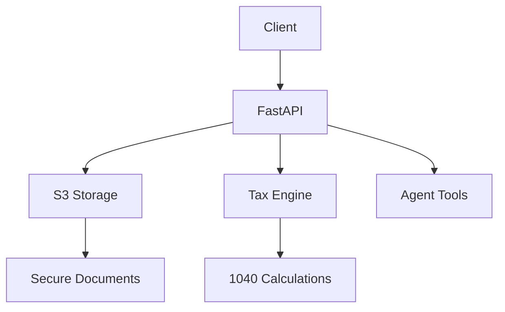

# TaxCRM API


A high-performance CRM and tax processing API built with FastAPI, designed for secure tax document handling and 1040 calculation.


## ✨ Key Features
Feature | 	Description	 | Status |
--------|----------------|--------|
Feature | 	Description	 | Status |
Secure Uploads |	S3 presigned URLs with client-side encryption	| ✅ Production |
1040 Calculator |	Standard deduction and basic credit support	| 🟡 Beta |
Agent Tools	| Intake workflows + e-signature stubs	| 🔶 In Development |
Audit Trail |	Immutable logging of all tax operations	| ✅ Production |

## 🚀 Quick Start
### Prerequisites
* Python 3.10+
* AWS credentials (for S3)
* Redis (for caching)

### Installation
```bash
# Clone repository
git clone https://github.com/zjerryxie/TaxCRM.git
cd TaxCRM/api

# Create virtual environment
python -m venv venv
source venv/bin/activate  # Linux/Mac
# venv\Scripts\activate  # Windows

# Install dependencies
pip install -r requirements.txt

# Configure environment
cp .env.example .env
nano .env  # Add your AWS credentials
```

###  Running the API
```bash
uvicorn main:app --reload
```

## 📚 API Reference
### Document Upload Flow
```python
@app.post("/upload")
async def create_upload():
    """Generate S3 presigned URL"""
    return {
        "url": s3.generate_presigned_url(...),
        "fields": {
            "key": "user_123/doc.pdf",
            "x-amz-algorithm": "AWS4-HMAC-SHA256"
        }
    }
```

### 1040 Calculation
``python
@app.post("/calculate/1040")
def calculate_1040(income: schemas.TaxInput):
    """Basic 1040 calculation"""
    taxable_income = income.wages - STANDARD_DEDUCTION_2024
    tax_owed = calculate_tax_bracket(taxable_income)
    return {
        "refund": income.withholding - tax_owed,
        "deductions": ["standard"]
    }
```

## 🔒 Security

* Data Encryption: AES-256 for PII at rest
* Access Control: JWT authentication
* Compliance:
** IRS Pub 1075 guidelines
** SOC 2 Type I ready

```bash
# Generate encryption keys
openssl rand -hex 32 > .encryption_key
```
## 🛠 Development
### Testing
```bash
pytest tests/ --cov=app --cov-report=html
```
### Building Docker Image
```bash
docker build -t taxcrm-api .
docker run -p 8000:8000 taxcrm-api
```

## 🤝 Contributing

1. Fork the repository
2. Create your feature branch (git checkout -b feature/amazing-feature)
3. Commit changes (git commit -m 'Add amazing feature')
4. Push to branch (git push origin feature/amazing-feature)
5. Open a Pull Request
