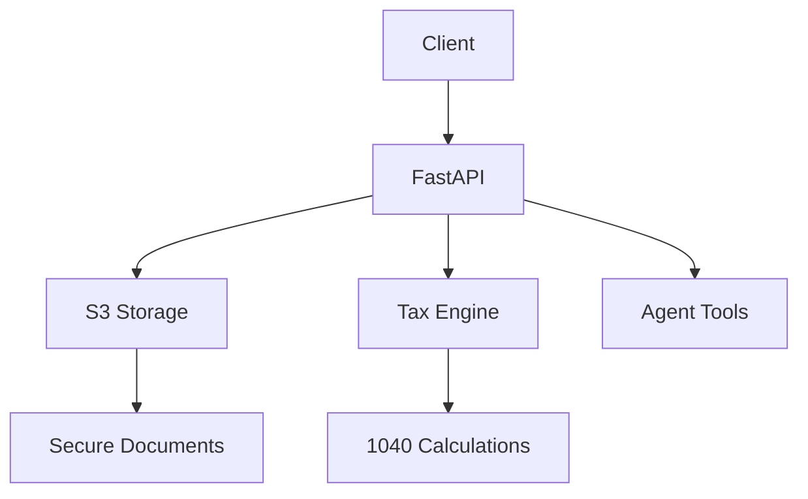

# TaxCRM API


A high-performance CRM and tax processing API built with FastAPI, designed for secure tax document handling and 1040 calculation.


## ✨ Key Features
Feature | 	Description	 | Status |
--------|----------------|--------|
Feature | 	Description	 | Status |
Secure Uploads |	S3 presigned URLs with client-side encryption	| ✅ Production |
1040 Calculator |	Standard deduction and basic credit support	| 🟡 Beta |
Agent Tools	| Intake workflows + e-signature stubs	| 🔶 In Development |
Audit Trail |	Immutable logging of all tax operations	| ✅ Production |

## 🚀 Quick Start
### Prerequisites
* Python 3.10+
* AWS credentials (for S3)
* Redis (for caching)

### Installation
```bash
# Clone repository
git clone https://github.com/zjerryxie/TaxCRM.git
cd TaxCRM/api

# Create virtual environment
python -m venv venv
source venv/bin/activate  # Linux/Mac
# venv\Scripts\activate  # Windows

# Install dependencies
pip install -r requirements.txt

# Configure environment
cp .env.example .env
nano .env  # Add your AWS credentials
```

###  Running the API
```bash
uvicorn main:app --reload
```


# TaxCRM API

A lightweight CRM + Tax Processing API (FastAPI).

## Features
- FastAPI backend
- Secure S3 presigned uploads
- Simple 1040 calculator
- Agent tool stubs (intake, e-sign)
- Logging + Audit trail

## Setup
```bash
git clone https://github.com/zjerryxie/TaxCRM.git
cd TaxCRM/api
pip install -r requirements.txt
uvicorn main:app --reload
